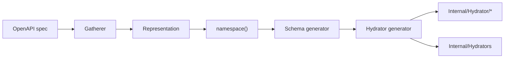

generator-hydrator
==================

[`FileGenerator`](https://github.com/php-openapi-tools/contract) for [OpenAPI Tools](https://github.com/php-openapi-tools) that emits [EventSauce ObjectHydrator](https://github.com/EventSaucePHP/ObjectHydrator) mappers for generated schema classes. Each path (and optionally each webhook) gets a dedicated hydrator; a central `Internal\Hydrators` facade implements `ObjectMapper` and routes by class name.


[](https://packagist.org/packages/openapi-tools/generator-hydrator)
[](https://packagist.org/packages/openapi-tools/generator-hydrator/stats)
[](https://packagist.org/packages/openapi-tools/generator-hydrator)

Installation
------------

```
composer require openapi-tools/generator-hydrator
```

Where it fits
-------------

This package runs during step 4 of the OpenAPI Tools pipeline — **after** [`generator-schema`](https://github.com/php-openapi-tools/generator-schema) has emitted the schema classes this generator reflects on:



Register `Hydrator` **after** `Schema`. The generator run loop `include_once`s each written file so later generators can depend on freshly emitted types; this generator uses `ReflectionMethod` on schema constructors when deciding which classes to pass to `ObjectMapperCodeGenerator`.

Components
----------

| Class | Purpose |
| --- | --- |
| `Hydrator` | Entry-point `FileGenerator`; emits per-scope hydrators and the central `Internal\Hydrators` facade |

AST construction delegates to [`generator-utils`](https://github.com/php-openapi-tools/generator-utils) (`ExpressionBuilder`, `MatchBuilder`, `StatementBuilder`). Hydration and serialization logic is produced by EventSauce's `ObjectMapperCodeGenerator`.

Usage
-----

`Hydrator` takes a shared [`nikic/php-parser`](https://github.com/nikic/PHP-Parser) `BuilderFactory` and a flag controlling webhook hydrators. Attach it to a package's `generators` list **after** `Schema`:

```php
use OpenAPITools\Generator\Hydrator\Hydrator;
use OpenAPITools\Generator\Schema\Schema;
use PhpParser\BuilderFactory;

$builderFactory = new BuilderFactory();

// inside Package(..., generators: [
//     new Schema($builderFactory),
//     new Hydrator($builderFactory, includeWebHookHydrators: true),
//     ...
// ])
```

Set `includeWebHookHydrators` to `false` when the package has no webhooks or when another generator (such as [`generator-psr-15-webhook-middleware`](https://github.com/php-openapi-tools/generator-psr-15-webhook-middleware)) owns webhook hydration.

A full configuration example lives in [`openapi-tools/generator`](https://github.com/php-openapi-tools/generator#configuration).

### Direct invocation

Useful in tests and custom tooling:

```php
use OpenAPITools\Generator\Hydrator\Hydrator;
use OpenAPITools\Generator\Schema\Schema;
use PhpParser\BuilderFactory;

$builderFactory = new BuilderFactory();

// Schema classes must exist before Hydrator runs — eval or include them first.
foreach (new Schema($builderFactory)->generate($package, $namespacedRepresentation) as $file) {
    // load $file into the runtime ...
}

foreach (new Hydrator($builderFactory, true)->generate($package, $namespacedRepresentation) as $file) {
    // $file->pathPrefix  — e.g. "src"
    // $file->fqcn        — e.g. "Internal\Hydrators" or "Internal\Hydrator\Operation\Root"
    // $file->contents    — PhpParser Node or pre-rendered string (ObjectMapperCodeGenerator output)
}
```

Generation order
----------------

`Hydrator::generate()` walks hydrators from the namespaced representation:

1. **Path hydrators** — one per entry in `$representation->client->paths`.
2. **Webhook hydrators** — one per entry in `$representation->webHooks` when `includeWebHookHydrators` is `true`.

For each scope it yields a dedicated `ObjectMapper` class, then yields the shared `Internal\Hydrators` facade last.

Within each per-scope hydrator, only schema classes whose `__construct` has at least one parameter are passed to `ObjectMapperCodeGenerator`. Schemas without constructor parameters are omitted from the generated mapper.

Output layout
-------------

Given namespace `ApiClients\Client\Example` and a single root path operation:

| Relative path | Kind |
| --- | --- |
| `Internal/Hydrator/Operation/Root.php` | Per-path `ObjectMapper` for schemas used on that path |
| `Internal/Hydrators.php` | Central facade implementing `ObjectMapper` |

Webhook scopes use `Internal/Hydrator/WebHook/{Name}.php` instead of `Operation/…`.

Generated code
--------------

### Per-scope hydrators

Each hydrator is a class generated by EventSauce's `ObjectMapperCodeGenerator`. It implements `ObjectMapper` with optimized `hydrateObject`, `hydrateObjects`, `serializeObject`, and `serializeObjects` methods — no reflection at runtime. Custom value types (such as `Ramsey\Uuid\UuidInterface`) get dedicated serialize helpers.

```php
namespace ApiClients\Client\Example\Internal\Hydrator\Operation;

use EventSauce\ObjectHydrator\ObjectMapper;

class Root implements ObjectMapper
{
    public function hydrateObject(string $className, array $payload): object
    {
        return match ($className) {
            \ApiClients\Client\Example\Schema\Basic::class => $this->hydrateApiClients⚡️Client⚡️Example⚡️Schema⚡️Basic($payload),
            default => throw new \RuntimeException("Cannot hydrate unknown class: {$className}"),
        };
    }

    // hydrateObjects, serializeObject, serializeObjects, and per-class helpers ...
}
```

### Central facade

`Internal\Hydrators` implements `ObjectMapper` and delegates to the per-scope hydrators. Schemas shared across paths appear once in the routing `match`, even when multiple hydrators reference them.

Lazy getters initialize each per-scope mapper on first use:

```php
namespace ApiClients\Client\Example\Internal;

final class Hydrators implements \EventSauce\ObjectHydrator\ObjectMapper
{
    private ?\ApiClients\Client\Example\Internal\Hydrator\Operation\Root $operation🌀Root = null;

    public function hydrateObject(string $className, array $payload): object
    {
        return match ($className) {
            \ApiClients\Client\Example\Schema\Basic::class
                => $this->getObjectMapperOperation🌀Root()->hydrateObject($className, $payload),
            default => throw new \RuntimeException("Cannot hydrate unknown class: {$className}"),
        };
    }

    public function getObjectMapperOperation🌀Root(): \ApiClients\Client\Example\Internal\Hydrator\Operation\Root
    {
        if (! $this->operation🌀Root instanceof \ApiClients\Client\Example\Internal\Hydrator\Operation\Root) {
            $this->operation🌀Root = new \ApiClients\Client\Example\Internal\Hydrator\Operation\Root();
        }

        return $this->operation🌀Root;
    }

    // hydrateObjects, serializeObject, serializeObjects, and getters for other scopes ...
}
```

Method names on the facade mirror the hydrator `methodName` from the representation (for example `Operation🌀Root`, `WebHook🪝Ping`).

Schema deduplication
--------------------

When the same schema class is collected by more than one path or webhook hydrator, the central `Internal\Hydrators` match includes it only once. Per-scope hydrators still list every schema they need; deduplication applies only to the facade's class-name routing.

Supported patterns
------------------

Behaviour is locked down through shared fixtures in [`openapi-tools/test-data`](https://github.com/php-openapi-tools/test-data). Each YAML file has a matching assertion class under `tests/DataTests/`.

| Fixture | What it exercises |
| --- | --- |
| `Basic` | Minimal object, `$ref`, UUID format, response headers |
| `ExampleData` | Scalars, formats, patterns, arrays, nullable unions |
| `Aliases` | Structurally identical inline objects → alias classes hydrated by one mapper |
| `NestedSchema` | Inline nested objects without `$ref` |
| `NestedReferenceSchema` | Nested objects via component `$ref` |
| `TripleNestedSchema` | Deep nesting with `$ref` on nested `schema` keyword |
| `DoubleUseOfTypes` | OpenAPI 3.1 `type` array combined with `anyOf` on one property |
| `BasicWebHooks` | Separate hydrators per webhook event |
| `DiscriminatedWebHooks` | Webhook payload with discriminated request-body variants |
| `MultiVariantWebHooks` | One webhook mapping to multiple schema variants |

Run the suite:

```shell
make unit-testing
```

For the full fixture roadmap and situation coverage matrix, see [`test-data/src/DataSets/PLAN.md`](https://github.com/php-openapi-tools/test-data/blob/main/src/DataSets/PLAN.md).

Related packages
----------------

| Package | Relationship |
| --- | --- |
| [`contract`](https://github.com/php-openapi-tools/contract) | `FileGenerator` and `Package` interfaces |
| [`representation`](https://github.com/php-openapi-tools/representation) | Input model (`Namespaced\Hydrator`, path and webhook hydrator metadata) |
| [`gatherer`](https://github.com/php-openapi-tools/gatherer) | Builds the representation and assigns schemas to path/webhook hydrators |
| [`generator-schema`](https://github.com/php-openapi-tools/generator-schema) | Must run before this package |
| [`generator-utils`](https://github.com/php-openapi-tools/generator-utils) | AST builders used for the facade class |
| [`generator`](https://github.com/php-openapi-tools/generator) | CLI and run loop that orchestrates all generators |
| [`eventsauce/object-hydrator`](https://github.com/EventSaucePHP/ObjectHydrator) | Runtime `ObjectMapper` interface and code generator |

Contributing
------------

Please see [CONTRIBUTING](CONTRIBUTING.md) for details.

License
-------

The MIT License (MIT)

Copyright (c) 2026 Cees-Jan Kiewiet

Permission is hereby granted, free of charge, to any person obtaining a copy
of this software and associated documentation files (the "Software"), to deal
in the Software without restriction, including without limitation the rights
to use, copy, modify, merge, publish, distribute, sublicense, and/or sell
copies of the Software, and to permit persons to whom the Software is
furnished to do so, subject to the following conditions:

The above copyright notice and this permission notice shall be included in all
copies or substantial portions of the Software.

THE SOFTWARE IS PROVIDED "AS IS", WITHOUT WARRANTY OF ANY KIND, EXPRESS OR
IMPLIED, INCLUDING BUT NOT LIMITED TO THE WARRANTIES OF MERCHANTABILITY,
FITNESS FOR A PARTICULAR PURPOSE AND NONINFRINGEMENT. IN NO EVENT SHALL THE
AUTHORS OR COPYRIGHT HOLDERS BE LIABLE FOR ANY CLAIM, DAMAGES OR OTHER
LIABILITY, WHETHER IN AN ACTION OF CONTRACT, TORT OR OTHERWISE, ARISING FROM,
OUT OF OR IN CONNECTION WITH THE SOFTWARE OR THE USE OR OTHER DEALINGS IN THE
SOFTWARE.
